.. container::
   :name: main

   .. container::
      :name: achter-main_container

      .. container::
         :name: main_container

         .. container::
            :name: header_container

            .. container::
               :name: menubalk

         .. container::
            :name: links_container

            .. container::
               :name: left_top

            .. container::
               :name: left

               .. container::
                  :name: adsense

         .. container::
            :name: rechts_container

            .. container::
               :name: right_top

            .. container::
               :name: right

               .. container::
                  :name: adsense

         .. container::
            :name: content_container

            .. container::
               :name: tekstweetjes

               .. rubric:: 
                  :name: top

               .. container::

               .. rubric:: Springoefeningen
                  :name: springoefeningen

               .. rubric:: Deel 1
                  :name: deel-1

               .. container::

                  +-----------------------------------+-----------------------------------+
                  |       `springoefening             |       `springoefening             |
                  | 1 <#springoefening1>`__           | 11 <#springoefening11>`__         |
                  |       `springoefening             |       `springoefening             |
                  | 2 <#springoefening2>`__           | 12 <#springoefening12>`__         |
                  |       `springoefening             |       `springoefening             |
                  | 3 <#springoefening3>`__           | 13 <#springoefening13>`__         |
                  |       `springoefening             |       `springoefening             |
                  | 4 <#springoefening4>`__           | 14 <#springoefening14>`__         |
                  |       `springoefening             |       `springoefening             |
                  | 5 <#springoefening5>`__           | 15 <#springoefening15>`__         |
                  |       `springoefening             |       `springoefening             |
                  | 6 <#springoefening6>`__           | 16 <#springoefening16>`__         |
                  |       `springoefening             |       `springoefening             |
                  | 7 <#springoefening7>`__           | 17 <#springoefening17>`__         |
                  |       `springoefening             |       `springoefening             |
                  | 8 <#springoefening8>`__           | 18 <#springoefening18>`__         |
                  |       `springoefening             |       `springoefening             |
                  | 9 <#springoefening9>`__           | 19 <#springoefening19>`__         |
                  |       `springoefening             |       `springoefening             |
                  | 10 <#springoefening10>`__         | 20 <#springoefening20>`__         |
                  +-----------------------------------+-----------------------------------+

                       
                  `springoefeningen-in-zakformaat <#springoefeningen%20in%20zakformaat>`__

               .. rubric:: 
                  :name: inleiding

               +-----------------------------------+-----------------------------------+
               | **Inleiding**                     |                                   |
               +-----------------------------------+-----------------------------------+
               | `Nog meer springopstelingen?      |                                   |
               | Springoefeningen, deel            |                                   |
               | 2. <springopstellingen.html>`__   |                                   |
               | `Springoefeningen voor            |                                   |
               | gevorderden? Springoefeningen,    |                                   |
               | deel                              |                                   |
               | 3. <springoefeningen-3.html>`__   |                                   |
               | • De aangegeven afstanden zijn    |                                   |
               | geschikt voor D/E pony's -        |                                   |
               | paarden.                          |                                   |
               | • Je moet weten hoe groot de      |                                   |
               | galopsprong is van jouw paard en  |                                   |
               | pas de afstanden daar eventueel   |                                   |
               | op aan.                           |                                   |
               | • Begin en einde van een oefening |                                   |
               | zijn belangrijke bestanddelen van |                                   |
               | elke oefening. Rijd ze dus        |                                   |
               | zorgvuldig en besteed er veel     |                                   |
               | aandacht aan.                     |                                   |
               | • Rijd eerst in een goed ritme    |                                   |
               | voordat je begint met springen.   |                                   |
               | • Rijd de hindernis recht aan.    |                                   |
               | • Besteed veel aandacht aan de    |                                   |
               | lijntjes tussen de hindernissen.  |                                   |
               | Neem de ruimte en ga, indien      |                                   |
               | mogelijk, steeds terug naar de    |                                   |
               | hoefslag. Rijd nette bochten en   |                                   |
               | kijk naar de volgende hindernis.  |                                   |
               | • Spring altijd over het midden   |                                   |
               | van de hindernis                  |                                   |
               | • Breng veel afwisseling in je    |                                   |
               | training. Ga b.v. na een rijtje   |                                   |
               | hindernissen afwisselend links-   |                                   |
               | en rechtsaf en spring een aantal  |                                   |
               | hindernissen op verschillende     |                                   |
               | volgorde.                         |                                   |
               | • Bedenk van te voren welke       |                                   |
               | volgorde je gaat springen. Ga     |                                   |
               | niet zomaar doelloos              |                                   |
               | rondspringen.                     |                                   |
               | • Doe, indien nodig, een stapje   |                                   |
               | terug in je training .            |                                   |
               | • Uiteraard heb je je paard warm  |                                   |
               | gereden voordat je start met      |                                   |
               | springen.                         |                                   |
               | Kijk voor de gemiddelde afstanden |                                   |
               | tussen de hindernissen bij:       |                                   |
               | `Afstandtabel                     |                                   |
               | <afstanden.html#afstandstabel>`__ |                                   |
               +-----------------------------------+-----------------------------------+

               .. rubric:: 
                  :name: springoefening1

               `terug naar boven <#top>`__

               +-----------------------------------+-----------------------------------+
               | **Springoefening 1**              |                                   |
               +-----------------------------------+-----------------------------------+
               | |springoefening1-1|               | Vooral voor een jong paard of een |
               |                                   | onervaren springruiter een        |
               |                                   | geschikte oefening.               |
               |                                   | **Opbouw**                        |
               |                                   | • Bouw alles op als aangegeven.   |
               |                                   | Houd voor ieder sprongetje een    |
               |                                   | ruimte om minstens 7 meter recht  |
               |                                   | aan te kunnen rijden.             |
               |                                   | • Maak van iedere hindernis       |
               |                                   | desnoods een balkje op de grond.  |
               |                                   | • De drafbalkjes liggen 1.20 -    |
               |                                   | 1.50 m. (D/E-pony - paard) van    |
               |                                   | elkaar. Deze kunnen alleen        |
               |                                   | gedraafd worden.                  |
               |                                   | • De galopbalkjes liggen 2.10 -   |
               |                                   | 2.75 m.(D/E-pony - paard) van     |
               |                                   | elkaar. Over de galopbalkjes kan  |
               |                                   | ook gedraafd worden.              |
               |                                   | • Zorg dat de hindernissen van    |
               |                                   | beide kanten gesprongen kunnen    |
               |                                   | worden door aan beide kanten een  |
               |                                   | `grondbalk                        |
               |                                   |  <hindernissen.html#grondbalk>`__ |
               |                                   | voor de hindernis te leggen.      |
               |                                   | **Doel**                          |
               |                                   | • Rustig en bewust sturen.        |
               |                                   | • Het paard laten wachten op wat  |
               |                                   | jij gaat doen.                    |
               |                                   | • Een dergelijk parcoursje gaan   |
               |                                   | zien als een ontspannen spelletje |
               |                                   | .                                 |
               |                                   | **Uitvoering**                    |
               |                                   | • Rijd dressuur in combinatie met |
               |                                   | de obstakels. Rijd eventueel      |
               |                                   | alles eerst in stap.              |
               |                                   | • Zorg voor veel afwisseling maar |
               |                                   | neem de tijd om naar een obstakel |
               |                                   | te sturen.                        |
               |                                   | • Ga eens halthouden tussen de    |
               |                                   | balkjes of voor/na een hindernis  |
               |                                   | of rijd een volte.                |
               +-----------------------------------+-----------------------------------+
               | **Let op:**                       |                                   |
               | • Rijd ik ieder obstakel          |                                   |
               | geconcentreerd en netjes over het |                                   |
               | midden?                           |                                   |
               | • Rijd ik vloeiende wendingen,    |                                   |
               | trek ik het paard niet plotseling |                                   |
               | om aan de teugel?                 |                                   |
               | • Breng ik voldoende afwisseling  |                                   |
               | in mijn lijntjes zodat mijn paard |                                   |
               | niet weeet wat ik ga doen?        |                                   |
               | • Stuur ik mijn paard bewust en   |                                   |
               | rustig naar het volgende          |                                   |
               | obstakel?                         |                                   |
               | • Kijk ik bij het ene obstakel al |                                   |
               | naar het volgende obstakel?       |                                   |
               +-----------------------------------+-----------------------------------+

               .. rubric:: 
                  :name: springoefening2

               `terug naar boven <#top>`__

               +-----------------------+-----------------------+-----------------------+
               | **Springoefening 2**  |                       |                       |
               +-----------------------+-----------------------+-----------------------+
               | |springoefening1-2|   | **Opbouw**            |                       |
               |                       | • Leg een eenvoudige  |                       |
               |                       | drafrij van drie      |                       |
               |                       | balkjes (1.20-1.50    |                       |
               |                       | m.)                   |                       |
               |                       | • Zet aansluitend een |                       |
               |                       | niet te hoog kruisje  |                       |
               |                       | op 2 - 2.75 m.        |                       |
               |                       | • Plaats de           |                       |
               |                       | hindernisrij vooraan  |                       |
               |                       | op de AC-lijn         |                       |
               |                       | **Uitvoering**        |                       |
               |                       | • Zorg eerst voor een |                       |
               |                       | taktmatige rustige    |                       |
               |                       | draf voordat je gaat  |                       |
               |                       | springen.             |                       |
               |                       | • Weet welke voltes   |                       |
               |                       | je gaat rijden en     |                       |
               |                       | geef duidelijke       |                       |
               |                       | aanwijzingen aan je   |                       |
               |                       | paard.                |                       |
               |                       | • Maak een            |                       |
               |                       | zorgvuldige wending   |                       |
               |                       | aan het begin.        |                       |
               |                       | • Zorg dat je recht   |                       |
               |                       | voor de drafbalkjes   |                       |
               |                       | komt                  |                       |
               |                       | • Loop de drafbalkjes |                       |
               |                       | goed over het midden. |                       |
               |                       | • Rijdt in een        |                       |
               |                       | verlichte zit.        |                       |
               |                       | • Spring rustig het   |                       |
               |                       | kruisje en richt je   |                       |
               |                       | blik op het rode      |                       |
               |                       | kruisje.              |                       |
               |                       | • Indien het paard in |                       |
               |                       | de goede galop landt, |                       |
               |                       | rijdt je door naar de |                       |
               |                       | volte.                |                       |
               |                       | • Indien het paard    |                       |
               |                       | niet goed landt, neem |                       |
               |                       | je hem terug en       |                       |
               |                       | spring je opnieuw aan |                       |
               |                       | op het aangegeven     |                       |
               |                       | punt.                 |                       |
               |                       | • Wissel de voltes    |                       |
               |                       | links en rechts af.   |                       |
               |                       | Stop pas met de       |                       |
               |                       | oefening als het      |                       |
               |                       | paard rustig zijn     |                       |
               |                       | oefeningen doet en je |                       |
               |                       | aanwijzingen begrepen |                       |
               |                       | heeft..               |                       |
               |                       | Als je paard netjes   |                       |
               |                       | in de gewenste galop  |                       |
               |                       | aanspringt kun je     |                       |
               |                       | proberen in de goede  |                       |
               |                       | galop te landen en    |                       |
               |                       | bij de tweede volte   |                       |
               |                       | een galopwissel te    |                       |
               |                       | rijden.               |                       |
               |                       | **Doel**              |                       |
               |                       | • Springtechniek      |                       |
               |                       | leren voor ruiter en  |                       |
               |                       | paard.                |                       |
               |                       | • Over de hindernis   |                       |
               |                       | kijken tijdens het    |                       |
               |                       | springen stimuleren.  |                       |
               |                       | • Controle na de      |                       |
               |                       | hindernis             |                       |
               |                       | • Voorbereiding op    |                       |
               |                       | het landen in linker- |                       |
               |                       | en rechter galop.     |                       |
               +-----------------------+-----------------------+-----------------------+
               | |image1|              | **Let op:**           |                       |
               |                       | • Maak ik een goede   |                       |
               | .. container::        | wending met stelling  |                       |
               | bronwit               | en buiging?           |                       |
               |                       | Zet eventueel een     |                       |
               |    Uit: Springreiten  | pylon neer waar je    |                       |
               |    mit system         | omheen rijdt.         |                       |
               |    101                | • Ga ik goed over het |                       |
               |    gymnastikreihen -  | midden van de balkjes |                       |
               |    vom einsteiger zum | zonder te slingeren?  |                       |
               |    profi              | • Trek ik mijn paard  |                       |
               |    Linda Allen        | niet in de mond boven |                       |
               |                       | de hindernis?         |                       |
               |                       | • Rijd ik de voltes   |                       |
               |                       | netjes rond?          |                       |
               |                       | • Springt mijn paard  |                       |
               |                       | aan in de juiste      |                       |
               |                       | galop?                |                       |
               |                       | • Maak ik de oefening |                       |
               |                       | netjes af?            |                       |
               +-----------------------+-----------------------+-----------------------+

               .. rubric:: 
                  :name: springoefening3

               `terug naar boven <#top>`__

               +-----------------------------------+-----------------------------------+
               | **Springoefening 3**              |                                   |
               +-----------------------------------+-----------------------------------+
               | |springoefening1-3|               | **Opbouw**                        |
               |                                   | • Leg een eenvoudige drafrij van  |
               |                                   | drie balkjes (1.20-1.50)          |
               |                                   | • Zet aansluitend de              |
               |                                   | hindernispalen met balkjes        |
               |                                   | ertussen op de grond              |
               |                                   | • Laat een helper naderhand eerst |
               |                                   | het achterste kruisje opbouwen en |
               |                                   | daarna het voorste                |
               |                                   | • Plaats de hindernisrij vooraan  |
               |                                   | op de AC-lijn                     |
               |                                   | **Uitvoering**                    |
               |                                   | • Zorg eerst voor een taktmatige  |
               |                                   | rustige draf voordat je gaat      |
               |                                   | springen.                         |
               |                                   | • Weet welke volte je gaat rijden |
               |                                   | en geef duidelijke aanwijzingen   |
               |                                   | aan je paard.                     |
               |                                   | • Maak een zorgvuldige wending    |
               |                                   | aan het begin.                    |
               |                                   | • Zorg dat je recht voor de       |
               |                                   | drafbalkjes komt                  |
               |                                   | • Loop de drafbalkjes goed over   |
               |                                   | het midden.                       |
               |                                   | • Rijdt in een verlichte zit.     |
               |                                   | • Spring rustig de kruisjes en    |
               |                                   | richt je blik op het rode         |
               |                                   | kruisje. Begin pas met de         |
               |                                   | kruisjes als het springen over de |
               |                                   | balkjes rustig verloopt.          |
               |                                   | • Indien het paard niet in de     |
               |                                   | galop landt die nodig is voor de  |
               |                                   | vooraf bedachte volte neem hem    |
               |                                   | dan terug in draf en springt      |
               |                                   | opnieuw aan.                      |
               |                                   | • Wissel de volte links, rechts,  |
               |                                   | links, links, rechts enz.         |
               |                                   | **Doel**                          |
               |                                   | • Springtechniek leren voor       |
               |                                   | ruiter en paard.                  |
               |                                   | • Over de hindernis kijken        |
               |                                   | tijdens het springen stimuleren.  |
               |                                   | • Controle na de hindernis.       |
               |                                   | • Landen in linker- en rechter    |
               |                                   | galop.                            |
               +-----------------------------------+-----------------------------------+
               | |image2|                          | **Let op:**                       |
               |                                   | • Springt mijn paard goed actief  |
               | .. container:: bronwit            | maar wel beheerst?                |
               |                                   | • Heb ik mijn blik op het rode    |
               |    Uit: Springreiten mit system   | kruisje gericht tijdens de        |
               |    101 gymnastikreihen -          | sprongen?                         |
               |    vom einsteiger zum profi       | • Kan ik in verlichte zit het     |
               |    Linda Allen                    | in-uitje springen en zit ik in    |
               |                                   | balans?                           |
               |                                   | • Hou ik mijn hakken goed naar    |
               |                                   | beneden tijdens de sprongen?      |
               |                                   | • Heb ik vooraf bepaald welke     |
               |                                   | volte ik ga rijden en kan ik in   |
               |                                   | de goede galop landen?            |
               |                                   | Land eventueel in draf en spring  |
               |                                   | pas aan in galop bij de volte.    |
               |                                   | • Maak ik een mooie ronde volte?  |
               |                                   | • Heb ik goede stelling en        |
               |                                   | buiging op de volte?              |
               +-----------------------------------+-----------------------------------+

               .. rubric:: 
                  :name: springoefening4

               `terug naar boven <#top>`__

               +-----------------------------------+-----------------------------------+
               | **Springoefening 4**              |                                   |
               +-----------------------------------+-----------------------------------+
               | |springoefening1-4|               | **Opbouw**                        |
               |                                   | • Leg een eenvoudige drafrij van  |
               |                                   | drie of vier balkjes (1.20-1.50). |
               |                                   | • Zet eerst een eenvoudig kruisje |
               |                                   | na de balkjes en verander die     |
               |                                   | later in een steilsprong en dan   |
               |                                   | in een oxer.                      |
               |                                   | • Zet pylonnen zoals op de        |
               |                                   | tekening.                         |
               |                                   | **Doel**                          |
               |                                   | • Controle na de sprong           |
               |                                   | • Het over de hindernis kijken    |
               |                                   | tijdens het springen stimuleren   |
               |                                   | **Uitvoering**                    |
               |                                   | • Rijd de slalom afwisselend      |
               |                                   | eerst linksom of rechtsom of sla  |
               |                                   | eens een pylon over.              |
               |                                   | Maak ook eens een cirkel om een   |
               |                                   | pylon.                            |
               |                                   | • Rijd afwisselend links en       |
               |                                   | rechtsom aan en wend ook          |
               |                                   | afwisselend links- en rechtsom na |
               |                                   | de oefening.                      |
               |                                   | • Als je paard alles rustig       |
               |                                   | uitvoert kun je de drafbalkjes    |
               |                                   | weghalen en de sprong in galop    |
               |                                   | nemen.                            |
               |                                   | • Neem je paard na de sprong in   |
               |                                   | draf terug en doe een oefening    |
               |                                   | met de pylonnen.                  |
               +-----------------------------------+-----------------------------------+
               | |image3|                          | **Let op:**                       |
               |                                   | • Kijk ik goed naar het blikpunt  |
               |                                   | als ik spring?                    |
               |                                   | • Kom ik goed mee boven de        |
               |                                   | hindernis en trek ik mijn paard   |
               |                                   | niet in de mond?                  |
               |                                   | • Breng ik voldoende afwisseling  |
               |                                   | in de oefening?                   |
               |                                   | • Heb ik goede buiging en         |
               |                                   | stelling om de pylonnen?          |
               |                                   | • Trek ik niet aan de teugels als |
               |                                   | ik om een pylon rijd maar stuur   |
               |                                   | ik door middel van een            |
               |                                   | samenwerking met benen en teugel? |
               |                                   | • Heb ik de oefening netjes       |
               |                                   | afgemaakt?                        |
               +-----------------------------------+-----------------------------------+

               .. rubric:: 
                  :name: springoefening5

               `terug naar boven <#top>`__

               +-----------------------------------+-----------------------------------+
               | **Springoefening 5**              |                                   |
               +-----------------------------------+-----------------------------------+
               | |springoefening1-5|               | **Opbouw**                        |
               |                                   | • Leg een eenvoudige drafrij van  |
               |                                   | vier balkjes op de AC-lijn        |
               |                                   | (1.20-1.50).                      |
               |                                   | • Zet een steilsprong en een oxer |
               |                                   | zoals op de tekening.             |
               |                                   | • Leg een grondbalk aan beide     |
               |                                   | zijden van de hindernis.          |
               |                                   | • Leg de balken van de oxer voor  |
               |                                   | en achter even hoog.              |
               |                                   | **Uitvoering**                    |
               |                                   | • Draaf eerst een aantal malen    |
               |                                   | over de drafbalkjes               |
               |                                   | • Spring dan een aantal malen de  |
               |                                   | steilsprong (of eerst een         |
               |                                   | kruisje) uit draf, afgewisseld    |
               |                                   | met het draven over de            |
               |                                   | drafbalkjes. Eventueel met een    |
               |                                   | drafbalkje voor de steilsprong.   |
               |                                   | (2.00 - 2.75)                     |
               |                                   | • Ga afwisselend halthouden, een  |
               |                                   | overgang maken naar stap of       |
               |                                   | gewoon doordraven tussen de       |
               |                                   | drafbalkjes.                      |
               |                                   | • Zorg voor afwisseling in je     |
               |                                   | lijntjes door o.a. de sprong van  |
               |                                   | twee kanten te springen.          |
               |                                   | • Neem daarna de sprong uit galop |
               |                                   | en wissel dat weer af met het     |
               |                                   | draven over de drafbalkjes en de  |
               |                                   | overgangen tussen de drafbalkjes. |
               |                                   | • Doe nu hetzelfde als de         |
               |                                   | voorgaande oefening met de oxer.  |
               |                                   | • Spring uiteindelijk beide       |
               |                                   | sprongen afwisselend uit draf en  |
               |                                   | uit galop.                        |
               |                                   | • Blijf tussendoor over de        |
               |                                   | drafbalkjes draven en de          |
               |                                   | overgangen ertussen maken.        |
               |                                   | **Doel**                          |
               |                                   | • Je paard gehoorzaam maken aan   |
               |                                   | de hulpen.                        |
               |                                   | • Voorkomen dat je paard wegloopt |
               |                                   | na een hindernis.                 |
               |                                   | • Goed leren sturen.              |
               +-----------------------------------+-----------------------------------+
               | **Let op:**                       |                                   |
               | • Heb ik van tevoren bedacht welk |                                   |
               | lijntje ik ga rijden en ben ik    |                                   |
               | niet zomaar doelloos rond gaan    |                                   |
               | rijden?                           |                                   |
               | • Kijk ik goed over de hindernis  |                                   |
               | heen als ik spring?               |                                   |
               | • Rijd ik een rechte lijn goed    |                                   |
               | recht en ga ik niet slingeren?    |                                   |
               | • Rijd ik een bocht netjes rond   |                                   |
               | en in de goede stelling?          |                                   |
               | • Gebruik ik de ruimte goed en    |                                   |
               | rijd ik naar de hoefslag waar dat |                                   |
               | mogelijk is en rijd ik goed de    |                                   |
               | hoeken in?                        |                                   |
               | • Zijn mijn overgangen netjes     |                                   |
               | tussen de balken en heb ik niet   |                                   |
               | aan de teugels getrokken?         |                                   |
               | • Draaf ik in het midden over de  |                                   |
               | balken en spring ik in het midden |                                   |
               | over de hindernis?                |                                   |
               +-----------------------------------+-----------------------------------+

               .. rubric:: 
                  :name: springoefening6

               `terug naar boven <#top>`__

               +-----------------------------------+-----------------------------------+
               | **Springoefening 6**              |                                   |
               +-----------------------------------+-----------------------------------+
               | |springoefening1-6|               | **Opbouw**                        |
               |                                   | • Zet een hindernis neer zoals in |
               | +------------------------------+  | oefening 1, voorbij het midden op |
               | | Bron:                        |  | de AC-lijn.                       |
               | | Springreiten mit system      |  | • Leg twee balkje als aangegeven  |
               | | 101 gymnastikreihen -        |  | op de tekening.                   |
               | | vom einsteiger zum profi     |  | • Zet twee pylonnen als           |
               | | Linda Allen                  |  | aangegeven.                       |
               | +------------------------------+  | **Uitvoering**                    |
               |                                   | • Draaf over de hindernis en rijd |
               | .. container:: iframe             | rechtdoor tussen de pylonnen      |
               |                                   | door.                             |
               |    .. rubric:: Video cannot be    | • Draaf over de hindernis en land |
               |       played.                     | in galop waarbij je probeert in   |
               |                                   | de goede galop te landen door een |
               |    :name: video-cannot-be-played. | scherpe bocht afwisselend te      |
               |                                   | maken. Je kijkt boven de          |
               |      :class: dmp_jsDisabled-title | hindernis naar de kant waar je    |
               |                                   | heengaat en beweegt je schouders  |
               |    .. container::                 | in dezelfde richting. Leg je      |
               |    dmp_jsDisabled-message         | buitenbeen iets achter de singel. |
               |                                   | • Herhaal de oefening meerdere    |
               |       Please enable JavaScript if | malen in dezelfde richting        |
               |       it is disabled in your      | voordat je van hand wisselt.      |
               |       browser.                    | • Breng daarna afwisseling in de  |
               |                                   | richting waar je naar toe gaat.   |
               |    .. container::                 | • Galoppeer dan afwisselend       |
               |       :name: dmp_jsEnabled        | rechtdoor of scherp de bocht om   |
               |                                   | waarbij je in de juiste galop     |
               |       .. container::              | landt. Je weet dus van te voren   |
               |          :name: playerv5_box      | welke kant je opgaat, ook als je  |
               |                                   | rechtdoor rijdt.                  |
               |          .. container::           | • Rijd na de bocht netjes recht   |
               |             :name: root_node      | door naar de balkjes. Neem je     |
               |                                   | paard voor de drafbalkjes terug   |
               |          .. container::           | in draf en spring over de balkjes |
               |          dmp_spinner              | aan in de goede galop.            |
               |                                   | • Ben je al verder gevorderd,     |
               |             .. container::        | rijd je een galopwissel over de   |
               |             dmp_spinner_image     | balkjes.                          |
               |                                   | • Als het niet direkt lukt, neem  |
               |                |image4|           | je paard dan terug en spring      |
               |                                   | opnieuw aan.                      |
               |             .. container::        | • Doe deze oefeningen niet te     |
               |                                   | lang. Stop zeker als het goed     |
               |            dmp_spinner_background | gaat!                             |
               |                                   | **Doel**                          |
               |                                   | • leren in de goede galop te      |
               |                                   | landen                            |
               |                                   | • galopwissel oefenen             |
               +-----------------------------------+-----------------------------------+
               | **Let op:**                       |                                   |
               | • Heb ik goed aangegeven in welke |                                   |
               | galop ik wil landen?              |                                   |
               | Je kijkt waar je naartoe wilt,    |                                   |
               | je draait je schouders iets in de |                                   |
               | rijrichting zonder je             |                                   |
               | binnenschouder te laten zakken,   |                                   |
               | je legt je buitenbeen iets achter |                                   |
               | de singel                         |                                   |
               | en je geeft meer druk met je      |                                   |
               | binnenbeen.                       |                                   |
               | • Rijd ik over het midden van de  |                                   |
               | balkjes.                          |                                   |
               | • Herstel ik rustig de gelop als  |                                   |
               | het niet goed gaat, zonder        |                                   |
               | geïrriteerd te raken.             |                                   |
               +-----------------------------------+-----------------------------------+

               .. rubric:: 
                  :name: springoefening7

               `terug naar boven <#top>`__

               +-----------------------------------+-----------------------------------+
               | **Springoefening 7**              |                                   |
               +-----------------------------------+-----------------------------------+
               | |springoefening1-7|   |image5|    |                                   |
               +-----------------------------------+-----------------------------------+
               | **Opbouw**                        |                                   |
               | • Zet een kruisje op de           |                                   |
               | diagonaal.                        |                                   |
               | • Leg een grondbalk aan beide     |                                   |
               | zijde van het kruisje.            |                                   |
               | • Zet een steilsprong en een oxer |                                   |
               | op minimaal 9 meter van de korte  |                                   |
               | zijde.                            |                                   |
               | • De oefening om van rechts naar  |                                   |
               | links te wisselen staat hier      |                                   |
               | eerst genoemd omdat de meeste     |                                   |
               | paarden dat makkelijker doen.     |                                   |
               | Galoppeert jouw paard rechtsom    |                                   |
               | makkelijker dan draai je de       |                                   |
               | volgorde om.                      |                                   |
               | **Uitvoering**                    |                                   |
               | • Spring over het steiltje en     |                                   |
               | land in de goede galop.           |                                   |
               | • Neem je paard na de bocht terug |                                   |
               | in draf en spring het kruisje.    |                                   |
               | • Spring dan de oxer.             |                                   |
               | • Als je paard over het kruisje   |                                   |
               | in de goede galop landt, probeer  |                                   |
               | dan in galop het kruisje te       |                                   |
               | springen en je paard te laten     |                                   |
               | wisselen van galop.               |                                   |
               | • Rijd eventueel een volte na de  |                                   |
               | hindernis.                        |                                   |
               | • Ga dan de andere kant oefenen.  |                                   |
               | **Doel**                          |                                   |
               | • landen in de goede galop.       |                                   |
               | • galopwissel oefenen             |                                   |
               +-----------------------------------+-----------------------------------+
               | **Let op:**                       |                                   |
               | • Rijd ik recht aan op de         |                                   |
               | hindernis en snijd ik de bochten  |                                   |
               | niet af?                          |                                   |
               | • Kijk ik goed naar de kant waar  |                                   |
               | ik naartoe wil?                   |                                   |
               | • Kijk ik over de hindernis en    |                                   |
               | niet naar beneden om te kijken of |                                   |
               | mijn paard wisselt?               |                                   |
               | • Rijd ik aktief, in takt en in   |                                   |
               | een rustig ritme?                 |                                   |
               +-----------------------------------+-----------------------------------+

               .. rubric:: 
                  :name: springoefening8

               `terug naar boven <#top>`__

               +-----------------------------------+-----------------------------------+
               | **Springoefening 8**              |                                   |
               +-----------------------------------+-----------------------------------+
               | |springoefening1-8a|              |                                   |
               | |springoefening1-8b|              |                                   |
               +-----------------------------------+-----------------------------------+
               | **Opbouw**                        |                                   |
               | • Plaats de in-uitjes als         |                                   |
               | aangegeven op een afstand van     |                                   |
               | 2.90 - 3.20 m.                    |                                   |
               | • Leg er een drafbalkje voor op   |                                   |
               | een afstand van 2.00 - 2.75 m.    |                                   |
               | • Plaats een steilsprong en de    |                                   |
               | oxer als aangegeven.              |                                   |
               | • Leg een grondbalk aan beide     |                                   |
               | zijden van de oxer en de          |                                   |
               | steilsprong.                      |                                   |
               | • Leg de balken van de oxer voor  |                                   |
               | en achter even hoog.              |                                   |
               | **Uitvoering**                    |                                   |
               | • Je kunt de hele oefening eerst  |                                   |
               | uitvoeren met de balkjes op de    |                                   |
               | grond.                            |                                   |
               | • Rijd het in-uitjes aan in draf  |                                   |
               | en land in de linker galop om de  |                                   |
               | lijn te vervolgen naar de oxer.   |                                   |
               | • Spring de steilsprong en land   |                                   |
               | in dezelfde galop.                |                                   |
               | • Neem je paard terug in draf.    |                                   |
               | • Draaf naar het tweede in-uitje  |                                   |
               | en land in de rechter galop.      |                                   |
               | • Indien de oefening goed gaat    |                                   |
               | neem je de drafbalk voor het      |                                   |
               | tweede in-uitje weg en rijd je    |                                   |
               | een galopwissel.                  |                                   |
               | • Laat een helper de oxer en de   |                                   |
               | steilsprong verwisselen en doe de |                                   |
               | oefening andersom.                |                                   |
               | **Doel**                          |                                   |
               | • In de goede galop landen.       |                                   |
               | • Een inleiding tot een           |                                   |
               | galopwissel boven de sprong.      |                                   |
               +-----------------------------------+-----------------------------------+
               | **Let op:**                       |                                   |
               | • Kan ik in de goede galop        |                                   |
               | landen?                           |                                   |
               | Zo niet, rijd dan een volte na de |                                   |
               | hindernis.                        |                                   |
               | • Kijk ik goed naar de volgende   |                                   |
               | hindernis zodat mijn paard weet   |                                   |
               | welke kant ik op wil?             |                                   |
               | • Kijk in ook bij de in-uitjes    |                                   |
               | naar de te volgen lijn na de      |                                   |
               | hindernis?                        |                                   |
               | • Wisselt mijn paard niet van     |                                   |
               | been het tweede in-uitje uit      |                                   |
               | galop?                            |                                   |
               | Maak dan een volte na de          |                                   |
               | hindernis.                        |                                   |
               +-----------------------------------+-----------------------------------+

               .. rubric:: 
                  :name: springoefening9

               `terug naar boven <#top>`__

               +-----------------------------------+-----------------------------------+
               | **Springoefening 9**              |                                   |
               +-----------------------------------+-----------------------------------+
               | |springoefening1-9|               | **Opbouw**                        |
               |                                   | • Bouw vier sprongen stervormig   |
               | +------------------------------+  | in het midden.                    |
               | | Bron:                        |  | • Leg balkjes in iedere hoek      |
               | | Springreiten mit system      |  | dicht aan de wand en in het       |
               | | 101 gymnastikreihen -        |  | midden van de korte zijde.        |
               | | vom einsteiger zum profi     |  | **Uivoering**                     |
               | | Linda Allen                  |  | • Begin de oefening met een       |
               | +------------------------------+  | wissel van rechts naar links. De  |
               |                                   | meeste paarden doen dat           |
               |                                   | makkelijker dan andersom.         |
               |                                   | Galoppeert jouw paard makkelijker |
               |                                   | in de rechter galop begin dan met |
               |                                   | een wissel van links naar rechs.  |
               |                                   | • Rijdt via de diagonaal over een |
               |                                   | hindernis.                        |
               |                                   | • Rijdt recht naar het balkje in  |
               |                                   | een goed ritme en een goed        |
               |                                   | balans.                           |
               |                                   | • Vraag duidelijk buiging en      |
               |                                   | stelling terwijl je over het      |
               |                                   | balkje springt en kijk goed naar  |
               |                                   | het volgende balkje.              |
               |                                   | • Als je paard over het eerste    |
               |                                   | balkje niet overspringt, of       |
               |                                   | overkruist gaat, gebruik je het   |
               |                                   | balkje in het midden van de korte |
               |                                   | zijde om alsnog over te springen. |
               |                                   | • Sluit de oefening af met nog    |
               |                                   | een rondje over het laatste       |
               |                                   | balkje om het geleerde te         |
               |                                   | bevestigen.                       |
               |                                   | • Doe de oefening afwisselend     |
               |                                   | over de verschillende balkjes.    |
               |                                   | **Doel**                          |
               |                                   | Galopwissel leren                 |
               +-----------------------------------+-----------------------------------+
               | **Let op:**                       |                                   |
               | • Heb ik alles in een goede takt  |                                   |
               | en rustig gereden?                |                                   |
               | Takt en ritme zijn belangrijker   |                                   |
               | dan een goede wissel. Als je      |                                   |
               | paard niet wisselt of overkruist  |                                   |
               | rijdt, rijd dan rustig door en    |                                   |
               | neem je paard na de oefening      |                                   |
               | rustig terug in draf om het       |                                   |
               | opnieuw te gaan proberen. Een     |                                   |
               | opgewonden paard is niet het doel |                                   |
               | van deze oefening en is altijd    |                                   |
               | zinloos!                          |                                   |
               | • Zat ik rechtop tijdens de       |                                   |
               | wissel over het balkje en leunde  |                                   |
               | ik niet naar de buitenkant?       |                                   |
               | • Gaf ik de goede hulpen om van   |                                   |
               | galop te wisselen?                |                                   |
               | Je kijkt waar je naartoe wilt,    |                                   |
               | je draait je schouders iets in de |                                   |
               | rijrichting zonder je             |                                   |
               | binnenschouder te laten zakken,   |                                   |
               | je legt je buitenbeen iets achter |                                   |
               | de singel                         |                                   |
               | en je geeft meer druk met je      |                                   |
               | binnenbeen.                       |                                   |
               +-----------------------------------+-----------------------------------+

               .. rubric:: 
                  :name: springoefening10

               `terug naar boven <#top>`__

               +-----------------------------------+-----------------------------------+
               | **Springoefening 10**             |                                   |
               +-----------------------------------+-----------------------------------+
               | |springoefening1-10a|             |                                   |
               | |springoefening1-10b|             |                                   |
               +-----------------------------------+-----------------------------------+
               | **Opbouw**                        |                                   |
               | • Zet een kruisje of steilsprong  |                                   |
               | op de AC-lijn met een grondbalk   |                                   |
               | aan beide zijden.                 |                                   |
               | • Leg balkjes als aangegeven op   |                                   |
               | drafafstand. (1.20 - 1.50 m.)     |                                   |
               | • Zet pylonnen neer zoals         |                                   |
               | aangegeven op de tekening.        |                                   |
               | • Bij de tweede oefening zet je   |                                   |
               | een hindernis achter de balkjes   |                                   |
               | of leg er eerst een balkje neer.  |                                   |
               | **Uitvoering**                    |                                   |
               | • Spring de hindernis in draf.    |                                   |
               | • Maak tussen de balkjes een      |                                   |
               | overgang naar stap of ga          |                                   |
               | halthouden of rijd gewoon door.   |                                   |
               | • Wissel de te rijden lijnen af.  |                                   |
               | • Rijd ook af en toe eerst tussen |                                   |
               | de balkjes door en dan de sprong. |                                   |
               | Rijd dan na de srpong rechtdoor.  |                                   |
               | • Voer de oefening nu uit in      |                                   |
               | galop. Let erop dat je paard in   |                                   |
               | de goede galop landt na de        |                                   |
               | hindernis.                        |                                   |
               | • Wanneer je paard de eerste      |                                   |
               | oefening rustig uitvoert ga je    |                                   |
               | een sprongetje oefenen in de      |                                   |
               | gebroken lijn. Als je paard de    |                                   |
               | pylonnen nog nodig heeft, laat je |                                   |
               | ze staan.                         |                                   |
               | • Rijd nu geen overgang tussen de |                                   |
               | balkjes.                          |                                   |
               | • Oefen eventueel eerst weer in   |                                   |
               | draf en dan in galop.             |                                   |
               | **Doel**                          |                                   |
               | Een gebroken lijn oefenen.        |                                   |
               +-----------------------------------+-----------------------------------+
               | **Let op:**                       |                                   |
               | • Heb ik netjes gestuurd en niet  |                                   |
               | getrokken aan de teugels?         |                                   |
               | • Heb ik de hulpen om in de       |                                   |
               | juiste galop te landen goed       |                                   |
               | aangegeven?                       |                                   |
               | Je kijkt waar je naartoe wilt,    |                                   |
               | je draait je schouders iets in de |                                   |
               | rijrichting zonder je             |                                   |
               | binnenschouder te laten zakken,   |                                   |
               | je legt je buitenbeen iets achter |                                   |
               | de singel                         |                                   |
               | en je geeft meer druk met je      |                                   |
               | binnenbeen.                       |                                   |
               | • Heb ik van te voren bedacht     |                                   |
               | welke lijnen ik ga rijden zodat   |                                   |
               | ik mijn paard bewust gestuurd     |                                   |
               | heb?                              |                                   |
               | • Voert mijn paard de gebroken    |                                   |
               | lijn rustig uit of raakt hij      |                                   |
               | opgewonden? Doe dan opnieuw de    |                                   |
               | eerste oefening in draf.          |                                   |
               | • Heb ik bedacht dat ik voor de   |                                   |
               | afwisseling over de drafbalkjes   |                                   |
               | kan draven?                       |                                   |
               +-----------------------------------+-----------------------------------+

               .. rubric:: 
                  :name: springoefening11

               `terug naar boven <#top>`__

               +-----------------------+-----------------------+-----------------------+
               | **Springoefening 11** |                       |                       |
               +-----------------------+-----------------------+-----------------------+
               | |springoefening1-11a| |                       |                       |
               |                       |                       |                       |
               | |springoefening1-11b| |                       |                       |
               |                       |                       |                       |
               | |springoefening1-11c| |                       |                       |
               +-----------------------+-----------------------+-----------------------+
               | **Opbouw**            |                       |                       |
               | • Plaats de           |                       |                       |
               | hindernissen als op   |                       |                       |
               | de tekening.          |                       |                       |
               | • Je kunt i.p.v. een  |                       |                       |
               | steilsprong eerst een |                       |                       |
               | kruisje neerzetten.   |                       |                       |
               | • De steilsprong      |                       |                       |
               | naast de oxer moet    |                       |                       |
               | minimaal 9 meter van  |                       |                       |
               | de korte zijde        |                       |                       |
               | geplaatst worden.     |                       |                       |
               | • De andere           |                       |                       |
               | steilsprong moet      |                       |                       |
               | vanaf H (of M) in een |                       |                       |
               | soepele bocht         |                       |                       |
               | aangereden kunnen     |                       |                       |
               | worden.               |                       |                       |
               | • Leg een grondbalk   |                       |                       |
               | aan beide zijden van  |                       |                       |
               | de hindernissen.      |                       |                       |
               | • Leg de balken van   |                       |                       |
               | de oxer voor en       |                       |                       |
               | achter even hoog.     |                       |                       |
               | • Indien het springen |                       |                       |
               | gedisciplineerd en    |                       |                       |
               | rustig verloopt kun   |                       |                       |
               | je de hindernissen    |                       |                       |
               | verhogen.             |                       |                       |
               | **Uivoering**         |                       |                       |
               | • Spring zoveel       |                       |                       |
               | mogelijke             |                       |                       |
               | verschillende         |                       |                       |
               | lijntjes over het     |                       |                       |
               | kleine parcours.      |                       |                       |
               | • Er is nog meer      |                       |                       |
               | mogelijk dan hier is  |                       |                       |
               | aangegeven, bedenk    |                       |                       |
               | zelf ook eens een     |                       |                       |
               | lijntje.              |                       |                       |
               | • Als je paard te     |                       |                       |
               | veel gaat trekken op  |                       |                       |
               | een sprong of         |                       |                       |
               | halverwege uit de     |                       |                       |
               | hand wegloopt, rijd   |                       |                       |
               | dan een overgang      |                       |                       |
               | tussen de             |                       |                       |
               | hindernissen of een   |                       |                       |
               | volte.                |                       |                       |
               | • Indien het van hand |                       |                       |
               | veranderen niet       |                       |                       |
               | soepel gaat neem je   |                       |                       |
               | paard dan voor de     |                       |                       |
               | hindernis terug in    |                       |                       |
               | draf. Kijk goed in de |                       |                       |
               | richting waar je naar |                       |                       |
               | toe wilt.             |                       |                       |
               | **Doel**              |                       |                       |
               | • Rustig, in takt en  |                       |                       |
               | ritme leren springen  |                       |                       |
               | van een paar          |                       |                       |
               | hindernissen.         |                       |                       |
               | • Goed leren sturen.  |                       |                       |
               +-----------------------+-----------------------+-----------------------+
               | **Let op:**           |                       |                       |
               | • Heb ik mijn paard   |                       |                       |
               | met veel              |                       |                       |
               | zelfvertrouwen door   |                       |                       |
               | het parcoursje        |                       |                       |
               | geleid?               |                       |                       |
               | • Ben ik steeds in de |                       |                       |
               | goede galop geland of |                       |                       |
               | heb ik het netjes     |                       |                       |
               | hersteld door mijn    |                       |                       |
               | paard rustig terug te |                       |                       |
               | nemen in draf en      |                       |                       |
               | opnieuw aan te        |                       |                       |
               | springen?             |                       |                       |
               | • Heb ik een          |                       |                       |
               | galopwissel kunnen    |                       |                       |
               | maken boven een       |                       |                       |
               | hindernis waar dat    |                       |                       |
               | nodig was?            |                       |                       |
               | • Ben ik rustig en    |                       |                       |
               | minimaal met mijn     |                       |                       |
               | aanwijzingen en ga ik |                       |                       |
               | niet extra veel been  |                       |                       |
               | geven voor de         |                       |                       |
               | hindernis? Een beetje |                       |                       |
               | extra druk met de     |                       |                       |
               | kuiten is goed maar   |                       |                       |
               | ga niet schoppen.     |                       |                       |
               | • Kijk ik goed naar   |                       |                       |
               | de volgende hindernis |                       |                       |
               | en niet naar beneden? |                       |                       |
               | • Maak ik het hele    |                       |                       |
               | lijntje netjes af     |                       |                       |
               | door even verder te   |                       |                       |
               | galopperen en een     |                       |                       |
               | overgang naar draf te |                       |                       |
               | maken op een door     |                       |                       |
               | mijzelf bepaalde plek |                       |                       |
               | en heb ik niet het    |                       |                       |
               | paard de beslissing   |                       |                       |
               | gelaten?              |                       |                       |
               +-----------------------+-----------------------+-----------------------+

               .. rubric:: 
                  :name: springoefening12

               `terug naar boven <#top>`__

               +-----------------------------------+-----------------------------------+
               | **Springoefening12**              |                                   |
               +-----------------------------------+-----------------------------------+
               | |springoefening1-12a|   |image6|  |                                   |
               |   |springoefening1-12b|           |                                   |
               +-----------------------------------+-----------------------------------+
               | **Opbouw**                        |                                   |
               | • Plaats de hindernissen op de    |                                   |
               | lange lijn 16.50 - 18.30 m. uit   |                                   |
               | elkaar. (4 galopsprongen, DE/pony |                                   |
               | -paard). Leg eventueel eerst      |                                   |
               | balkjes neer om te kijken of de   |                                   |
               | afstand voor jouw paard prettig   |                                   |
               | is. Je hebt een vrij korte bocht  |                                   |
               | voor het lijntje dus het kan zijn |                                   |
               | dat daardoor de afstand verkort   |                                   |
               | moet worden.                      |                                   |
               | • Plaats de andere hindernissen   |                                   |
               | als aangegeven. Je kunt deze ook  |                                   |
               | vervangen door balkjes.           |                                   |
               | • Leg een grondbalk aan beide     |                                   |
               | zijden van de hindernissen.       |                                   |
               | • Leg de balken van de oxer voor  |                                   |
               | en achter even hoog.              |                                   |
               | **Uitvoering**                    |                                   |
               | • Begin niet direkt het hele      |                                   |
               | lijntje te springen maar oefen    |                                   |
               | onderdelen van dit parcoursje.    |                                   |
               | • Kijk goed naar het blikpunt als |                                   |
               | je de eerste hindernis springt    |                                   |
               | van de lange lijn.                |                                   |
               | • Wanneer je paard in het lange   |                                   |
               | lijntje te veel wegrent naar de   |                                   |
               | tweede hindernis, rijd dan een    |                                   |
               | volte tussen de hindernissen of   |                                   |
               | neem hem terug in draf of ga      |                                   |
               | halthouden tussen de              |                                   |
               | hindernissen. Je paard moet op    |                                   |
               | jou leren wachten.                |                                   |
               | • Tel je galopsprongen tussen de  |                                   |
               | hindernissen hardop en laat een   |                                   |
               | helper controleren of je het goed |                                   |
               | doet. (3 galopsprongen)           |                                   |
               | • Wanneer je een lijntje gaat     |                                   |
               | springen, bedenk dan voor je      |                                   |
               | begint wat je gaat doen om te     |                                   |
               | zorgen dat je bewust stuurt.      |                                   |
               | . • Het laatste lijntje is voor   |                                   |
               | goed getrainde paarden omdat de   |                                   |
               | bochten erg kort zijn en er       |                                   |
               | tweemaal achter elkaar van hand   |                                   |
               | veranderd moet worden.            |                                   |
               | • Het laatste lijntje kunnen de   |                                   |
               | hindernissen langs de lange zijde |                                   |
               | in draf genomen worden door een   |                                   |
               | minder ervaren paard of ruiter.   |                                   |
               | • Indien het van hand veranderen  |                                   |
               | niet soepel gaat neem je paard    |                                   |
               | dan voor de hindernis terug in    |                                   |
               | draf. Kijk goed in de richting    |                                   |
               | waar je naar toe wilt.            |                                   |
               | • Indien je de lijn van de        |                                   |
               | oxer-steilsprong andersom         |                                   |
               | springt, moet je er rekening meer |                                   |
               | houden dat de afstand misschien   |                                   |
               | aangepast moet worden.            |                                   |
               | **Doel**                          |                                   |
               | • Het springen van een rechte     |                                   |
               | lijn met een bepaald aantal       |                                   |
               | galopsprongen.                    |                                   |
               | • Voorkomen dat je paard op de    |                                   |
               | tweede hindernis afstormt.        |                                   |
               | • Leren sturen, vooral een bocht  |                                   |
               | kort voor een hindernis.          |                                   |
               | • Van galop wisselen boven de     |                                   |
               | hindernis.                        |                                   |
               +-----------------------------------+-----------------------------------+
               | **Let op:**                       |                                   |
               | • Blijft mijn paard rustig tussen |                                   |
               | de hindernissen en bij het rijden |                                   |
               | van de korte bochten?             |                                   |
               | • Land ik in de goede galop en    |                                   |
               | kan ik wisselen?                  |                                   |
               | • Rijd ik recht op de             |                                   |
               | hindernissen aan en snijd ik de   |                                   |
               | bochten voor en na de hindernis   |                                   |
               | niet af?                          |                                   |
               | • Spring ik over het midden van   |                                   |
               | de hindernis?                     |                                   |
               | • Heb ik voldoende afwisseling    |                                   |
               | gebracht in de lijnen die ik reed |                                   |
               | zodat mijn paard niet wist wat ik |                                   |
               | ging springen en hij op mij moest |                                   |
               | wachten?                          |                                   |
               +-----------------------------------+-----------------------------------+

               .. rubric:: 
                  :name: springoefening13

               `terug naar boven <#top>`__

               +-----------------------------------------------------------------------+
               | **Springoefening 13**                                                 |
               +-----------------------------------------------------------------------+
               | |springoefening1-13a|   |springoefening1-13b|   |springoefening1-13c| |
               +-----------------------------------------------------------------------+
               | |image7|                                                              |
               +-----------------------------------------------------------------------+
               | .. container:: iframe                                                 |
               |                                                                       |
               |    .. container::                                                     |
               |       :name: player                                                   |
               |                                                                       |
               |    .. container:: player-unavailable                                  |
               |                                                                       |
               |       .. rubric:: Er is een fout opgetreden.                          |
               |          :name: er-is-een-fout-opgetreden.                            |
               |          :class: message                                              |
               |                                                                       |
               |       .. container:: submessage                                       |
               |                                                                       |
               |          `Bekijk deze video op                                        |
               |                                                                       |
               |      www.youtube.com <https://www.youtube.com/watch?v=4ODM3tVWV5M>`__ |
               |          of zet JavaScript aan als dit uitstaat in je browser.        |
               +-----------------------------------------------------------------------+
               | **Opbouw**                                                            |
               | • Zet het lijntje hindernissen op de AC-lijn.                         |
               | • Zet er twee steilsprongen schuin naast als aangegeven op de         |
               | tekening. Leg grondbalkjes aan beide zijden van de steilsprongen      |
               | • Zet twee pylonnen als aangegeven.                                   |
               | **Uitvoering**                                                        |
               | • Wanneer je aarzelt, leg je alle hindernissen als een balkje op de   |
               | grond.                                                                |
               | • Begin het in-uitje te springen vanuit draf en draaf rechtdoor over  |
               | de volgende hindernis.                                                |
               | • Draaf dan afwisselend rechtsaf, linksaf en rechtdoor.               |
               | • Wanneer dat rustig gaat in een lekker ritme kom dan in vanuit draf  |
               | en galoppeer verder rechtdoor naar de oxer. Verander eventueel de     |
               | afstand als het niet lekker past op de galopafstand van jouw paard.   |
               | • Ga dan afwisselend rechtdoor en links- en rechtsaf. Vergeet niet na |
               | de oxer afwisselend links- en rechtsaf te gaan. Als je paard te       |
               | heftig wordt of het sturen gaat niet lekker ga dan de oefening weer   |
               | in draf doen.                                                         |
               | • Als je het in-uitje vanuit galop wilt doen, verleg je het           |
               | drafbalkje naar de galopafstand of je verwijdert het.                 |
               | • Spring dan afwisselend parcours 1, 2 en 3. Misschien kun je zelf    |
               | ook nog andere lijntjes verzinnen. De lijn van de oxer en het         |
               | in-uitje mag je niet andersom springen! Dan moet je een hindernis van |
               | het in-uitje weghalen en de afstand aanpassen. (de afstand wordt      |
               | kleiner!)                                                             |
               | **Doel**                                                              |
               | • Het springen van een rechte lijn met een bepaald aantal             |
               | galopsprongen.                                                        |
               | • Voorkomen dat je paard op de tweede hindernis afstormt en op jou    |
               | leert wachten wat jij wilt gaan springen.                             |
               | • leren sturen                                                        |
               | • van galop wisselen boven de hindernis                               |
               +-----------------------------------------------------------------------+
               | **Let op:**                                                           |
               | • Stuur ik met m'n benen en trek ik niet teveel aan de teugels?       |
               | • Heb ik gekeken naar de volgende hindernis?                          |
               | • Blijft mijn paard rustig tussen de hindernissen?                    |
               | • Ben ik steeds in de goede galop geland?                             |
               | • Heb ik de hindernissen in het midden genomen?                       |
               | • Ga ik niet slingeren op de lange rechte lijn?                       |
               +-----------------------------------------------------------------------+

               .. rubric:: 
                  :name: springoefening14

               `terug naar boven <#top>`__

               +-----------------------------------+-----------------------------------+
               | **Springoefening 14**             |                                   |
               +-----------------------------------+-----------------------------------+
               | |springoefening1-14|              | **Opbouw**                        |
               |                                   | • Zet twee steilsprongen,         |
               |                                   | kruisjes of balkjes op ongeveer   |
               |                                   | 21.50 m.                          |
               |                                   | **Uitvoering**                    |
               |                                   | • Begin met 5 gelijkmatige        |
               |                                   | galopsprongen en kijk of de       |
               |                                   | afstand lekker past. Verzet       |
               |                                   | eventueel een hindernis. Tel je   |
               |                                   | galopsprongen hardop mee.         |
               |                                   | • Rijd afwisselend rechts en      |
               |                                   | links aan en ga afwisselend       |
               |                                   | rechts- en linksaf na de          |
               |                                   | hindernissen.                     |
               |                                   | • Indien je paard op de tweede    |
               |                                   | hindernis afstormt, rijd je af en |
               |                                   | toe een volte tussen de           |
               |                                   | hindernissen of je zet hem stil.  |
               |                                   | • Als je paard de voorgaande      |
               |                                   | oefening rustig uitvoert en       |
               |                                   | gelijkmatig, ga je 4              |
               |                                   | galopsprongen rijden tussen de    |
               |                                   | hindernissen. Tel je              |
               |                                   | galopsprongen hardop mee.         |
               |                                   | Rijd je paard al in de bocht met  |
               |                                   | extra impuls en verzameling naar  |
               |                                   | de eerste hindernis. Verleng nu   |
               |                                   | je galopsprongen tussen de        |
               |                                   | hindernissen.                     |
               |                                   | • Doe dezelfde oefening van de    |
               |                                   | andere kant.                      |
               |                                   | • Ga nu 6 galopsprongen rijden    |
               |                                   | tussen de hindernissen.           |
               |                                   | Verzamel je paard (Let op: niet   |
               |                                   | vertragen!) voor de eerste        |
               |                                   | hindernis en neem je paard verder |
               |                                   | terug tussen de hindernissen. Het |
               |                                   | moeten wel actieve galopsprongen  |
               |                                   | blijven.                          |
               |                                   | • Wissel 4, 5 of 6 galopsprongen  |
               |                                   | af.                               |
               |                                   | • Herhaal deze oefening tijdens   |
               |                                   | je gehele springloopbaan. Ook     |
               |                                   | professionals doen deze training  |
               |                                   | bijna iedere dag.                 |
               |                                   | **Doel**                          |
               |                                   | • galopsprongen verkleinen of     |
               |                                   | verlengen                         |
               |                                   | • volledige controle van de       |
               |                                   | ruiter tussen de hindernissen     |
               |                                   | • galopsprongen leren voelen      |
               |                                   | • galopsprongen leren vergroten   |
               |                                   | en niet versnellen                |
               |                                   | **Toelichting**                   |
               |                                   | Het verkorten of verlengen van de |
               |                                   | galopsprongen wordt al bepaald in |
               |                                   | de bocht voor de eerste           |
               |                                   | hindernis.                        |
               +-----------------------------------+-----------------------------------+
               | .. container:: iframe             |                                   |
               |                                   |                                   |
               |    .. container::                 |                                   |
               |       :name: player               |                                   |
               |                                   |                                   |
               |    .. container::                 |                                   |
               |    player-unavailable             |                                   |
               |                                   |                                   |
               |       .. rubric:: Er is een fout  |                                   |
               |          opgetreden.              |                                   |
               |                                   |                                   |
               | :name: er-is-een-fout-opgetreden. |                                   |
               |          :class: message          |                                   |
               |                                   |                                   |
               |       .. container:: submessage   |                                   |
               |                                   |                                   |
               |          `Bekijk deze video op    |                                   |
               |                                   |                                   |
               |   www.youtube.com <https://www.yo |                                   |
               | utube.com/watch?v=XzMJ5NF6w7U>`__ |                                   |
               |          of zet JavaScript aan    |                                   |
               |          als dit uitstaat in je   |                                   |
               |          browser.                 |                                   |
               |                                   |                                   |
               |                                   |                                   |
               |                                   |                                   |
               | .. container:: iframe             |                                   |
               |                                   |                                   |
               |    .. rubric:: Video cannot be    |                                   |
               |       played.                     |                                   |
               |                                   |                                   |
               |    :name: video-cannot-be-played. |                                   |
               |                                   |                                   |
               |      :class: dmp_jsDisabled-title |                                   |
               |                                   |                                   |
               |    .. container::                 |                                   |
               |    dmp_jsDisabled-message         |                                   |
               |                                   |                                   |
               |       Please enable JavaScript if |                                   |
               |       it is disabled in your      |                                   |
               |       browser.                    |                                   |
               |                                   |                                   |
               |    .. container::                 |                                   |
               |       :name: dmp_jsEnabled        |                                   |
               |                                   |                                   |
               |       .. container::              |                                   |
               |          :name: playerv5_box      |                                   |
               |                                   |                                   |
               |          .. container::           |                                   |
               |             :name: root_node      |                                   |
               |                                   |                                   |
               |          .. container::           |                                   |
               |          dmp_spinner              |                                   |
               |                                   |                                   |
               |             .. container::        |                                   |
               |             dmp_spinner_image     |                                   |
               |                                   |                                   |
               |                |image8|           |                                   |
               |                                   |                                   |
               |             .. container::        |                                   |
               |                                   |                                   |
               |            dmp_spinner_background |                                   |
               +-----------------------------------+-----------------------------------+
               | **Let op:**                       |                                   |
               | • Heb ik goed geteld en tel ik    |                                   |
               | niet de landing van de eerste     |                                   |
               | sprong mee?                       |                                   |
               | • Zijn de galopsprongen tussen de |                                   |
               | hindernissen even groot, ook als  |                                   |
               | ik 7 of 8 galopsprongen rijd?     |                                   |
               | • Ga ik niet schoppen of trekken  |                                   |
               | om resultaat te krijgen?          |                                   |
               +-----------------------------------+-----------------------------------+

               .. rubric:: 
                  :name: springoefening15

               `terug naar boven <#top>`__

               +-----------------------------------------------------------------------+
               | **Springoefening 15**                                                 |
               +-----------------------------------------------------------------------+
               | |springoefening1-15a|   |springoefening1-15b|                         |
               +-----------------------------------------------------------------------+
               | **Opbouw**                                                            |
               | • Bouw de hindernissen als op de tekening.                            |
               | • Houd in het midden een ruimte van ongeveer 3.00 meter.              |
               | **Uitvoering**                                                        |
               | • Spring eerst een aantal malen over een hindernis en rijd rechtuit.  |
               | • Rijd dan figuur 1, zowel linksom als rechtsom.                      |
               | • Rijd dan figuur 2. Je rijdt een kleine volte naar buiten over de    |
               | eerste hindernis, dan neem je de volte in het midden, daarna een      |
               | volte naar buiten over de tweede hindernis, enz.                      |
               | • Doe dit ook in beide richtingen.                                    |
               | • Als je paard al verder gevorderd is in de training, kun je de       |
               | oefening in galop uitvoeren.                                          |
               | • Bouw de hindernissen beslist niet te hoog!                          |
               | **Doel**                                                              |
               | • gymnastiseren en balans                                             |
               | • stelling en buiging                                                 |
               | • snelle reactie trainen op de hulpen                                 |
               +-----------------------------------------------------------------------+
               | **Let op:**                                                           |
               | • Rijd ik in de goede stelling en buiging?                            |
               | • Maak ik de cirkels mooi rond? Zet desnoods pylonnen neer.           |
               | • Rijd ik over het midden van de hindernissen?                        |
               | • Kan ik mijn paard in een goed ritme houden en valt hij niet terug   |
               | in tempo of wordt hij te heet? (Vereenvoudig de oefening!)            |
               +-----------------------------------------------------------------------+

               .. rubric:: 
                  :name: springoefening16

               `terug naar boven <#top>`__

               +-----------------------------------+-----------------------------------+
               | **Springoefening 16**             |                                   |
               +-----------------------------------+-----------------------------------+
               | |springoefening1-16|              | **Opbouw**                        |
               |                                   | • Zet drie hindernissen op de A-C |
               |                                   | lijn, afstand: 2.90-3.20 (DE/pony |
               |                                   | - paard).                         |
               |                                   | • Vervang het middelste kruisje   |
               |                                   | eerst met een balkje op de grond. |
               |                                   | • Verander later de kruisjes in   |
               |                                   | steilsprongen.                    |
               |                                   | • Leg een drafbalkje ervoor (2.00 |
               |                                   | - 2.75).                          |
               |                                   | • Als het lijntje van de andere   |
               |                                   | kant gaat springen verleg je het  |
               |                                   | drafbalkje.                       |
               |                                   | • Zet de steilsprongen als        |
               |                                   | aangegeven op de tekening.        |
               |                                   | **Uitvoering**                    |
               |                                   | • Leg eventueel alle balken op de |
               |                                   | grond op drafafstand en draaf er  |
               |                                   | een paar keer over in de          |
               |                                   | verlichte zit.                    |
               |                                   | • Bouw de laatste hindernis op en |
               |                                   | spring deze nadat je over de      |
               |                                   | resterende drafbalkjes gedraafd   |
               |                                   | hebt. Het laatste drafbalkje ligt |
               |                                   | ongeveer 2.00 - 2.75 voor de      |
               |                                   | sprong.                           |
               |                                   | • Bouw dan op dezelfde manier de  |
               |                                   | tweede hindernis op en spring het |
               |                                   | in-uitje na de drafbalkjes.       |
               |                                   | • Bouw dan de eerste hindernis op |
               |                                   | en vervang de middelste hindernis |
               |                                   | door een balk op de grond. Spring |
               |                                   | nu na de combinatie de twee       |
               |                                   | andere sprongen.                  |
               |                                   | • Bouw alle drie kruisjes en      |
               |                                   | spring het lijntje van beide      |
               |                                   | kanten. (vergeet niet de drafbalk |
               |                                   | te verleggen). Spring na de       |
               |                                   | combinatie de twee steilsprongen. |
               |                                   | • Maak van de kruisjes,           |
               |                                   | steilsprongen.                    |
               |                                   | • Ga zowel links als rechtsaf na  |
               |                                   | het springlijntje en wissel wel   |
               |                                   | en niet van richting boven de     |
               |                                   | steilsprong. Breng afwisseling in |
               |                                   | de te springen parcourtjes.       |
               |                                   | • Verwijder de middelste en       |
               |                                   | spring de dubbelsprong. Doe net   |
               |                                   | alsof de middelste sprong er nog  |
               |                                   | staat en geef de galopsprong      |
               |                                   | tussen de hindernissen bewust     |
               |                                   | aan.                              |
               |                                   | **Doel**                          |
               |                                   | • een dubbelsprong leren springen |
               |                                   | • gymnastiseren                   |
               |                                   | • verbeteren springtechniek,      |
               |                                   | leren basculeren.                 |
               |                                   | • galopwissel leren boven de      |
               |                                   | sprong                            |
               |                                   | • leren sturen                    |
               +-----------------------------------+-----------------------------------+
               | **Let op:**                       |                                   |
               | • Heb ik het springlijntje in de  |                                   |
               | verlichte zit gesprongen?         |                                   |
               | • Zoek ik de ruimte door steeds   |                                   |
               | rechtuit naar de hoefslag te      |                                   |
               | rijden?                           |                                   |
               | • Spring ik netjes over het       |                                   |
               | midden van de hindernissen?       |                                   |
               | • Rijd ik de beide steilsprongen  |                                   |
               | recht aan?                        |                                   |
               | • Kijk ik al naar de hindernis    |                                   |
               | voordat ik afwend?                |                                   |
               | • Gaf ik de goede hulpen voor de  |                                   |
               | galopwissel?                      |                                   |
               | Je kijkt waar je naartoe wilt,    |                                   |
               | je draait je schouders iets in de |                                   |
               | rijrichting zonder je             |                                   |
               | binnenschouder te laten zakken,   |                                   |
               | je legt je buitenbeen iets achter |                                   |
               | de singel                         |                                   |
               | en je geeft meer druk met je      |                                   |
               | binnenbeen.                       |                                   |
               +-----------------------------------+-----------------------------------+

               .. rubric:: 
                  :name: springoefening17

               `terug naar boven <#top>`__

               +-----------------------------------+-----------------------------------+
               | **Springoefening 17**             |                                   |
               +-----------------------------------+-----------------------------------+
               | |springoefening1-17a|             |                                   |
               | |springoefening1-17b|             |                                   |
               | |springoefening1-17c|             |                                   |
               +-----------------------------------+-----------------------------------+
               | **Opbouw**                        |                                   |
               | • Zet om en om een balkje en een  |                                   |
               | hindernis op een grote volte met  |                                   |
               | een tussenruimte van 2.90 - 3.20  |                                   |
               | m. (normale afstand vanuit galop  |                                   |
               | is 3.00 - 3.50, maar in een volte |                                   |
               | is de afstand korter.)            |                                   |
               | • Zet een steilsprong en een oxer |                                   |
               | op een afstand van 9.50 - 10.50   |                                   |
               | m. zoals op de tekening           |                                   |
               | • Leg een grondbalk aan beide     |                                   |
               | zijden van de hindernis.          |                                   |
               | • Leg de balken van de oxer voor  |                                   |
               | en achter even hoog.              |                                   |
               | **Uivoering**                     |                                   |
               | • Ga je paard inspringen over de  |                                   |
               | steilsprong en de dubbelsprong.   |                                   |
               | • Indien je de lijn van de        |                                   |
               | oxer-steilsprong andersom         |                                   |
               | springt, moet je er rekening meer |                                   |
               | houden dat de afstand misschien   |                                   |
               | aangepast moet worden.            |                                   |
               | • Leg dan de balkjes van de       |                                   |
               | hindernissen die op de volte      |                                   |
               | staan op de grond zodat je een    |                                   |
               | complete lijn van balkjes hebt.   |                                   |
               | • Rijd het lijntje op de volte in |                                   |
               | galop van beide kanten. Begin met |                                   |
               | je makkelijke kant wat meestal de |                                   |
               | linker kant is.                   |                                   |
               | • Zet dan één voor één de         |                                   |
               | hindernissen iets omhoog.         |                                   |
               | • Spring voor het juiste ritme af |                                   |
               | en toe een hindernis voor het     |                                   |
               | lijntje en erna.                  |                                   |
               | **Doel**                          |                                   |
               | • in ritme en cadans leren        |                                   |
               | springen.                         |                                   |
               | • buiging van je paard            |                                   |
               | verbeteren.                       |                                   |
               | • springtechniek verbeteren.      |                                   |
               | (basculeren)                      |                                   |
               +-----------------------------------+-----------------------------------+
               | **Let op:**                       |                                   |
               | • Kan mijn paard het juiste ritme |                                   |
               | vinden?                           |                                   |
               | Verminder eventueel het aantal    |                                   |
               | balkjes.                          |                                   |
               | • Springt mijn paard links- en    |                                   |
               | rechtsom even makkelijk?          |                                   |
               | Doe de oefening vaker aan de      |                                   |
               | moeilijke kant dan aan de         |                                   |
               | makkelijke kant.                  |                                   |
               | • Kan ik na de oefening makkelijk |                                   |
               | doorrijden om een volgende        |                                   |
               | hindernis te springen?            |                                   |
               | • Zit ik in balans boven het      |                                   |
               | lijntje op de volte en zit ik in  |                                   |
               | de verlichte zit?                 |                                   |
               | • Blijf ik goed naar voren kijken |                                   |
               | naar de volgende hindernis?       |                                   |
               | • Rijd ik over het midden van de  |                                   |
               | hindernissen?                     |                                   |
               +-----------------------------------+-----------------------------------+

               .. rubric:: 
                  :name: springoefening18

               `terug naar boven <#top>`__

               +-----------------------------------+-----------------------------------+
               | **Springoefening18**              |                                   |
               +-----------------------------------+-----------------------------------+
               | |springoefening1-18a|             |                                   |
               | |springoefening1-18b|             |                                   |
               | |springoefening1-18c|             |                                   |
               +-----------------------------------+-----------------------------------+
               | **Opbouw**                        |                                   |
               | • Zet 5 hindernissen op de        |                                   |
               | AC-lijn als aangegeven op de      |                                   |
               | tekening.                         |                                   |
               | **Uivoering**                     |                                   |
               | • Doe de eerste oefening eerst in |                                   |
               | draf                              |                                   |
               | • Zig-zag ook eens over alle      |                                   |
               | hindernissen.                     |                                   |
               | • Oefen daarna in galop de tweede |                                   |
               | en de derde oefening.             |                                   |
               | • Er zijn nog veel meer lijntjes  |                                   |
               | mogelijk.                         |                                   |
               | • Wanneer jij en je paard verder  |                                   |
               | gevorderd zijn met springen kun   |                                   |
               | je de eerste oefening ook in      |                                   |
               | galop doen.                       |                                   |
               | **Doel**                          |                                   |
               | • behendigheid.                   |                                   |
               | • buiging van je paard            |                                   |
               | verbeteren.                       |                                   |
               | • galopwissels boven de sprong    |                                   |
               | • gebroken lijn oefenen           |                                   |
               | • bochttechniek verbeteren        |                                   |
               | • stuurtechniek verbeteren        |                                   |
               +-----------------------------------+-----------------------------------+
               | **Let op:**                       |                                   |
               | • Rijd ik recht over het midden   |                                   |
               | van de hindernis?                 |                                   |
               | • Zoek ik de ruimte op en snijd   |                                   |
               | ik de bochten niet af?            |                                   |
               | • Wisselt mijn paard correct en   |                                   |
               | geef ik de goede hulpen?          |                                   |
               | • Rijd ik de bochten met mijn     |                                   |
               | benen en trek ik niet aan de      |                                   |
               | teugel?                           |                                   |
               +-----------------------------------+-----------------------------------+

               .. rubric:: 
                  :name: springoefening19

               `terug naar boven <#top>`__

               +-----------------------------------+-----------------------------------+
               | **Springoefening19**              |                                   |
               +-----------------------------------+-----------------------------------+
               | |springoefening1-19a|             |                                   |
               | |springoefening1-19b|             |                                   |
               | |springoefening1-19c|             |                                   |
               +-----------------------------------+-----------------------------------+
               | **Opbouw**                        |                                   |
               | • Plaats hindernissen als         |                                   |
               | aangegeven. De triple kan ook een |                                   |
               | oxer zijn of een steilsprong      |                                   |
               | • Leg aan beide kanten een        |                                   |
               | grondbalk zodat de hindernissen   |                                   |
               | van twee kanten gesprongen kunnen |                                   |
               | worden.                           |                                   |
               | • Leg de balken van de oxer voor  |                                   |
               | en achter even hoog.              |                                   |
               | • Plaats het in-uitje als         |                                   |
               | aangegeven op een afstand van     |                                   |
               | 2.90 - 3.20 m.                    |                                   |
               | • Drafbalkje ligt ongeveer 2.00 - |                                   |
               | 2.75 voor de sprong.              |                                   |
               | • Afstand van in-uitje tot de     |                                   |
               | steilsprong is ongeveer 12.00 -   |                                   |
               | 13.10 m. (3 galopsprongen)        |                                   |
               | • Afstand van oxer (oefening 18b) |                                   |
               | naar in-uitje ongeveer 13.00 -    |                                   |
               | 15.00 m. Ongeveer in het midden   |                                   |
               | van het in-uitje.                 |                                   |
               | • Indien je de triple van de      |                                   |
               | andere kant springt, laat je een  |                                   |
               | helper de hindernis aanpassen.    |                                   |
               | **Uivoering**                     |                                   |
               | • Rijd het in-uitje aan in draf   |                                   |
               | en spring vervolgens de andere    |                                   |
               | hindernissen..                    |                                   |
               | • Laat een helper het in-uitje    |                                   |
               | veranderen in een oxer.           |                                   |
               | • Rijd af en toe een volte voor   |                                   |
               | de hindernis, vooral als je paard |                                   |
               | te gehaast is voor of na de       |                                   |
               | sprong.                           |                                   |
               | • Breng veel variaties in de te   |                                   |
               | rijden lijnen. Er zijn nog veel   |                                   |
               | meer mogelijkheden dan hier       |                                   |
               | aangegeven.                       |                                   |
               | **Doel**                          |                                   |
               | • springtechniek paard verbeteren |                                   |
               | • galopwissels boven de sprong    |                                   |
               | • gebroken lijn oefenen           |                                   |
               | • bochttechniek verbeteren        |                                   |
               | • stuurtechniek verbeteren        |                                   |
               | • triple springen                 |                                   |
               +-----------------------------------+-----------------------------------+
               | **Let op:**                       |                                   |
               | • Rijd ik een gebroken lijn       |                                   |
               | zodanig dat ik de tweede          |                                   |
               | hindernis recht aanrijd?          |                                   |
               | • Zoek ik de ruimte op en snijd   |                                   |
               | ik de bochten niet af?            |                                   |
               | • Wisselt mijn paard correct en   |                                   |
               | geef ik de goede hulpen?          |                                   |
               +-----------------------------------+-----------------------------------+

               .. rubric:: 
                  :name: springoefening20

               `terug naar boven <#top>`__

               +-----------------------------------+-----------------------------------+
               | **Springoefening 20**             |                                   |
               +-----------------------------------+-----------------------------------+
               | |springoefening1-20|              | **Opbouw**                        |
               |                                   | • Plaats verschillende            |
               |                                   | sprongetjes als aangegeven. Bouw  |
               |                                   | ze vooral niet te hoog.           |
               |                                   | • Op de BE-lijn leg je balkjes.   |
               |                                   | • Begin met het plaatsen op de    |
               |                                   | BE-lijn en AC-lijn.               |
               |                                   | • De middelllijn van de cirkel is |
               |                                   | ongeveer 9.50 - 10.50 m.          |
               |                                   | • Controleer of de                |
               |                                   | tegenoverliggende hindernis recht |
               |                                   | achter de voorgaande staat.       |
               |                                   | **Uivoering**                     |
               |                                   | Deze cirkel biedt een enorm       |
               |                                   | aantal mogelijkheden:             |
               |                                   | • Draaf of galoppeer om de        |
               |                                   | cirkel. Vooral op de hand waarop  |
               |                                   | je paard buigzaam is (de holle    |
               |                                   | kant).                            |
               |                                   | • Draaf of galoppeer in de        |
               |                                   | cirkel. Vooral op de hand waarop  |
               |                                   | je paard minder buigzaam is (de   |
               |                                   | bolle kant).                      |
               |                                   | • Spring of draaf de veschillende |
               |                                   | combinaties. Ook verschillende    |
               |                                   | gebroken lijnen zijn mogelijk.    |
               |                                   | • Bij een ruime cirkel kun je ook |
               |                                   | nog eens tussen de hindernissen   |
               |                                   | door sturen. Vooral wanneer je    |
               |                                   | meer balkjes legt i.p.v. de       |
               |                                   | hindernissen.                     |
               |                                   | • Rijd vooral rechtdoor na het    |
               |                                   | springen van een combinatie. Zoek |
               |                                   | de ruimte.                        |
               |                                   | **Doel**                          |
               |                                   | • Volte rijden in juiste stelling |
               |                                   | en buiging.                       |
               |                                   | • Leren wachten op de hulpen van  |
               |                                   | de ruiter.                        |
               |                                   | • Correct sturen.                 |
               +-----------------------------------+-----------------------------------+
               | **Let op:**                       |                                   |
               | • Stuur ik de wendingen met de    |                                   |
               | benen en trek ik mijn paard niet  |                                   |
               | om aan de teugel?                 |                                   |
               | • Kijk ik goed waar ik naar toe   |                                   |
               | wil?                              |                                   |
               | • Blijf ik midden boven mijn      |                                   |
               | paard zitten en draai ik alleen   |                                   |
               | mijn schouders in de richting     |                                   |
               | waar ik naar toe wil?             |                                   |
               +-----------------------------------+-----------------------------------+

               .. rubric:: 
                  :name: springoefeningen-in-zakformaat

               `terug naar boven <#top>`__

               +-----------------------------------+-----------------------------------+
               | **Springoefeningen in             |                                   |
               | zakformaat**                      |                                   |
               +-----------------------------------+-----------------------------------+
               | |springboekje|                    | Wil je verschillende              |
               |                                   | springoefeningen en enkele        |
               |                                   | parcoursschetsen in een handig    |
               |                                   | boekje?                           |
               |                                   | Een leuk geschenk voor jezelf, je |
               |                                   | vriend(in) of familielid.         |
               |                                   | `Lees meer                        |
               |                                   | .                                 |
               |                                   | ........... <../boekjes/boekjes/b |
               |                                   | estel-boekje.php#springboekje>`__ |
               +-----------------------------------+-----------------------------------+
               | **Dressuuroefeningen in           |                                   |
               | zakformaat**                      |                                   |
               +-----------------------------------+-----------------------------------+
               | |dressuurboekje|                  | Wil je verschillende              |
               |                                   | dressuuroefeningen in een handig  |
               |                                   | boekje?                           |
               |                                   | Een leuk geschenk voor jezelf, je |
               |                                   | vriend(in) of familielid.         |
               |                                   | `Lees meer                        |
               |                                   | ...                               |
               |                                   | ......... <../boekjes/boekjes/bes |
               |                                   | tel-boekje.php#dressuurboekje>`__ |
               +-----------------------------------+-----------------------------------+

               `terug naar boven <#top>`__

.. container::
   :name: footer_container

   .. container::
      :name: footer

      .. container::
         :name: tekstreclame

      .. container::
         :name: infomenu

      .. container::
         :name: webdesign

         Webdesign: ELJO

.. |springoefening1-1| image:: springoefeningen/springoefening20.jpg
   :name: springoefening1-1
   :width: 200px
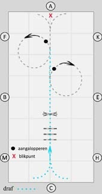
.. |image1| image:: springoefeningen%20/springoefening1b.jpg
   :width: 200px
.. |springoefening1-3| image:: springoefeningen/springoefening2.jpg
   :name: springoefening1-3
   :width: 200px
.. |image2| image:: springoefeningen%20/springoefening2b.jpg
   :width: 200px
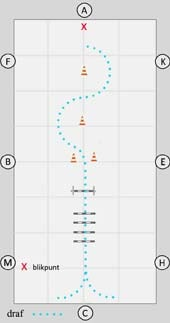
.. |image3| image:: springoefeningen%20/springoefening3b.jpg
   :width: 200px
.. |springoefening1-5| image:: springoefeningen/springoefening4.jpg
   :name: springoefening1-5
   :width: 200px
.. |springoefening1-6| image:: springoefeningen/springoefening5.jpg
   :name: springoefening1-6
   :width: 200px
.. |image4| image:: data:image/svg+xml;base64,PHN2ZyBjbGFzcz0iZG1wX3NwaW5uZXJfY2lyY2xlIiB2aWV3Ym94PSIwIDAgNTAgNTAiPgo8Y2lyY2xlIGNsYXNzPSJwYXRoIiBjeD0iMjUiIGN5PSIyNSIgcj0iMjAiIGZpbGw9Im5vbmUiIHN0cm9rZT0iI2ZmZiIgc3Ryb2tlLXdpZHRoPSI0IiB0cmFuc2Zvcm09InJvdGF0ZSgtOTAgMjUgMjUpIj48L2NpcmNsZT4KPC9zdmc+
   :class: dmp_spinner_circle
.. |springoefening1-7| image:: springoefeningen/springoefening6.jpg
   :name: springoefening1-7
   :width: 180px
.. |image5| image:: springoefeningen%20/springoefening6b.jpg
   :width: 180px
.. |springoefening1-8a| image:: springoefeningen/springoefening7a.jpg
   :name: springoefening1-8a
   :width: 180px
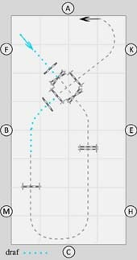
.. |springoefening1-9| image:: springoefeningen/springoefening8.jpg
   :name: springoefening1-9
   :width: 200px
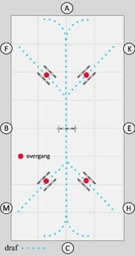
.. |springoefening1-10b| image:: springoefeningen/springoefening9b.jpg
   :name: springoefening1-10b
   :width: 180px
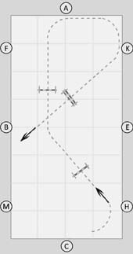
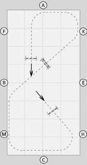
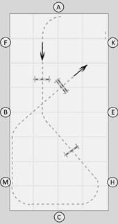
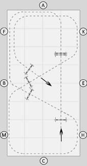
.. |image6| image:: springoefeningen/springoefening11b.jpg
   :name: springoefening1-12a
   :width: 180px
.. |springoefening1-12b| image:: springoefeningen/springoefening11c.jpg
   :name: springoefening1-12b
   :width: 180px
.. |springoefening1-13a| image:: springoefeningen/springoefening12a.jpg
   :name: springoefening1-13a
   :width: 180px
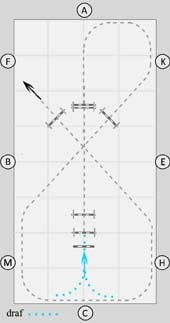
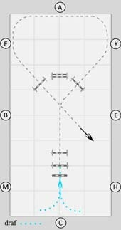
.. |image7| image:: springoefeningen%20/springlijntje10.jpg
   :width: 500px
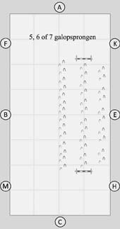
.. |image8| image:: data:image/svg+xml;base64,PHN2ZyBjbGFzcz0iZG1wX3NwaW5uZXJfY2lyY2xlIiB2aWV3Ym94PSIwIDAgNTAgNTAiPgo8Y2lyY2xlIGNsYXNzPSJwYXRoIiBjeD0iMjUiIGN5PSIyNSIgcj0iMjAiIGZpbGw9Im5vbmUiIHN0cm9rZT0iI2ZmZiIgc3Ryb2tlLXdpZHRoPSI0IiB0cmFuc2Zvcm09InJvdGF0ZSgtOTAgMjUgMjUpIj48L2NpcmNsZT4KPC9zdmc+
   :class: dmp_spinner_circle
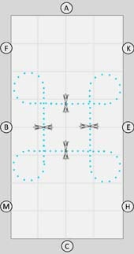
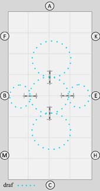
.. |springoefening1-16| image:: springoefeningen/springoefening15.jpg
   :name: springoefening1-16
   :width: 200px
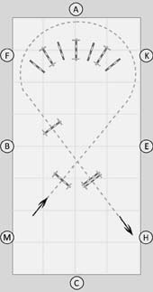
.. |springoefening1-17b| image:: springoefeningen/springoefening16b.jpg
   :name: springoefening1-17b
   :width: 180px
.. |springoefening1-17c| image:: springoefeningen/springoefening16c.jpg
   :name: springoefening1-17c
   :width: 180px
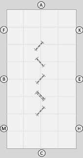
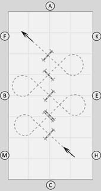
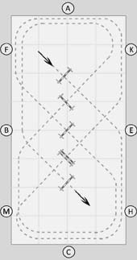
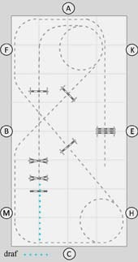
.. |springoefening1-19b| image:: springoefeningen/springoefening18b.jpg
   :name: springoefening1-19b
   :width: 180px
.. |springoefening1-19c| image:: springoefeningen/springoefening18c.jpg
   :name: springoefening1-19c
   :width: 180px
.. |springoefening1-20| image:: springoefeningen/springoefening19.jpg
   :name: springoefening1-20
   :width: 200px
.. |springboekje| image:: ../boekjes/boekjes/springboekje.png
   :name: springboekje
   :width: 200px
.. |dressuurboekje| image:: ../boekjes/boekjes/dressuurboekje.png
   :name: dressuurboekje
   :width: 200px
